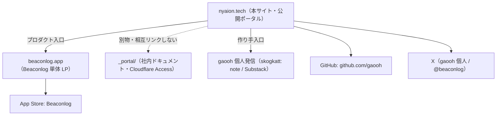

# nyaiontech 個人事業主ポータル 要件・デザイン準備ブリーフ

> 作成日: 2026-06-16
> 種別: 要件定義 + 情報設計(IA) + ワイヤーフレーム仕様（実装前のデザイン準備）
> 状態: ドラフト（次工程＝デザイン/実装へ引き渡す前提）
> 想定ドメイン: `nyaion.tech`（bundle id `tech.nyaion.musette` と同系の屋号ドメイン）
> 関連: [Beaconlog product-contract](https://github.com/gaooh/nyaiontech/blob/main/app-business/products/musette/product-contract.md) / [x-promotion-posts（表現ガード）](https://github.com/gaooh/nyaiontech/blob/main/app-business/copy/x-promotion-posts-2026-06-tour-de-fukushima.md) / [studio/CLAUDE.md（skogkatt 分社）](https://github.com/gaooh/nyaiontech/blob/main/studio/CLAUDE.md)

このファイルは、屋号「nyaiontech」の対外ポータルサイトを **デザインできる状態に落とすための要件・IA・ワイヤー仕様** をまとめたもの。今回はサイト実装（HTML/CSS/コード）は行わず、本ブリーフの確定までをスコープとする。

---

## 1. 概要・ポジショニング

### 1.1 目的

屋号「nyaiontech」（個人事業主）の対外的な「顔」となる 1 ページのポータルサイトを用意する。役割は次の 2 つに絞る。

1. **作っているプロダクトへの入口**（現状は Beaconlog 1 本。将来増やせる構造）
2. **作り手 gaooh 個人プロフィールへの入口**（X / GitHub / note・Substack / Beaconlog 公式 X）

「事業の総合パンフレット」ではなく、**入口（ハブ）** に徹する。詳細な売り込みは各プロダクトの LP（例: `beaconlog.app`）に委ねる。

### 1.2 ターゲット

| 区分 | 想定する来訪者 | このサイトでしたいこと |
|---|---|---|
| プロダクト関心層 | Beaconlog を知って屋号を辿ってきた人 | 他に何を作っているか/誰が作っているかを知り、信頼の裏付けを得る |
| 取引・協業相手 | 仕事・協業の打診を検討している人 | 屋号・活動領域・連絡手段を確認する |
| gaooh を知りたい人 | SNS や発信から流入 | 個人発信・GitHub・SNS への導線を得る |

### 1.3 屋号とドメインの整合

- 屋号: **nyaiontech**
- 想定ドメイン: **`nyaion.tech`**（Beaconlog の bundle id `tech.nyaion.musette` と同じ `nyaion.tech` 系。屋号・プロダクト・ドメインが一貫する）
- 表記ゆれ注意: 「nyaiontech（屋号・1 語）」と「nyaion.tech（ドメイン）」を区別して使う。

### 1.4 既存資産との関係（混同しないこと）

本サイトは以下の既存資産と **別物**。役割の重複を避ける。



| 資産 | 役割 | 本サイトとの関係 |
|---|---|---|
| 本サイト `nyaion.tech` | 屋号の公開ハブ | 本ブリーフの対象 |
| `beaconlog.app` | Beaconlog 専用 LP | 本サイトの Products から「詳しく見る」で送客 |
| App Store（Beaconlog） | 配信・入手 | 本サイト/LP から導線 |
| `_portal/`（社内） | 社内ドキュメント表示層（Starlight + Access） | **非公開。本サイトからはリンクしない** |
| skogkatt（個人発信） | gaooh の note/Substack 等 | About のプロフィールリンクとして外部送客 |

---

## 2. サイトマップ / 情報設計（IA）

### 2.1 基本方針

**1 ページ（ランディング）構成**を基本とする。各ブロックは独立セクションとして設計し、将来ページ分割（例: `/products`, `/about`）に展開しやすくする。アンカーリンク（`#products`, `#about`）でセクション内移動できる構成。

### 2.2 セクション一覧（上から順）

| # | セクション | 目的 | 主要素 |
|---|---|---|---|
| 1 | Header / Nav | 最小ナビ | 屋号ロゴ（テキスト可）、アンカー: Products / About |
| 2 | Hero | 屋号と一言紹介 | 屋号、タグライン、補足 1 文、主導線（Products へスクロール） |
| 3 | Products | プロダクト群への入口 | プロダクトカード（現状 Beaconlog 1 枚 + 拡張テンプレ） |
| 4 | About / gaooh | 作り手プロフィールとリンク | 一言プロフィール、プロフィールリンク集 |
| 5 | Footer | 最小の事業者情報 | 屋号、コピーライト、プライバシー/問い合わせリンク |

### 2.3 将来分割の指針

- Products が 3 件以上になったら `/products` 一覧ページへ昇格を検討。LP 構成は維持。
- About を厚くする場合（事業者概要・提供サービス・特商法）は `/about` を新設。本サイトのトップは「ハブ」に保つ。

---

## 3. コンテンツ・インベントリ

### 3.1 Hero

- 屋号: **nyaiontech**
- タグライン（暫定案・要 owner 確認・複数案）:
  - 案 A: 「持久系競技者のためのプロダクトをつくる、個人開発の屋号。」
  - 案 B: 「記録から、次の一歩を。個人開発スタジオ nyaiontech。」
- 補足 1 文（暫定）: 「ロードバイク・ラン・トライアスロンに本気で取り組む人のためのアプリを作っています。」
- 注: タグラインで健康効果・成績向上を断定しない（§3.5 表現ガード）。

### 3.2 Products カードの項目定義（データモデル）

将来プロダクトを増やせるよう、カードは以下の項目を持つ「配列の 1 要素」として定義する。

| 項目 | 必須 | 内容 | 例（Beaconlog） |
|---|---|---|---|
| `name` | ○ | プロダクト名（公開ブランド名） | Beaconlog |
| `tagline` | ○ | 一言説明（現在形は shipped 範囲のみ） | レース・ロングライドの補給を、イベント単位で残すログアプリ |
| `status` | ○ | `published` / `in-development` / `concept` | published |
| `category` | △ | カテゴリ/対象 | ロードバイク・ラン・トライアスロン |
| `appStoreUrl` | △ | App Store URL（公開時） | https://apps.apple.com/jp/app/beaconlog/id6777063659 |
| `lpUrl` | △ | 専用 LP | https://beaconlog.app |
| `officialX` | △ | プロダクト公式 SNS | @beaconlog |
| `thumbnail` | △ | アイコン/サムネ（後日素材） | （要素材） |

### 3.3 Beaconlog 実データ（現状の唯一の公開プロダクト）

- 名称: **Beaconlog**（コードネーム Musette。公開表記は `Beaconlog` 1 語のみ。`Beacon` 単体・`Beacon Log`・派生語は使わない）
- ステータス: `published`（App Store 公開中）
- App Store（正本・JP）: `https://apps.apple.com/jp/app/beaconlog/id6777063659`
- 専用 LP: `https://beaconlog.app`
- 公式 X: `@beaconlog`
- 一言説明（現在形で言ってよい = product-contract で `shipped` のもののみ）:
  - 「レースやロングライドの補給を『何を・いつ・どれだけ』イベント単位で残すログアプリ。Plan → Actual → Review で前回の補給を見返せます。」
- 現在形で言ってよい機能（shipped・[product-contract](https://github.com/gaooh/nyaiontech/blob/main/app-business/products/musette/product-contract.md) Feature 1〜3）:
  - Plan / Actual / Review の 3 段階記録
  - コースプロファイル × 補給タイミングの記録
  - 補給アイテム（ジェル・ドリンク・カフェイン量・サプリ・メモ）の記録
  - レースプリセットからの作成
  - Free（直近 3 件保存）/ Pro Unlock 買い切り（保存件数の無制限化）
- **将来形でしか書かないもの**（`requested`・未 shipped。本サイトでも現在形にしない）:
  - 横断集計、CSV エクスポート、イベント複製、Strava/Garmin 連携、英語 UI

### 3.4 gaooh プロフィールのリンク先（About）

| ラベル | リンク先 | 確定状況 |
|---|---|---|
| X（gaooh 個人） | `（要 gaooh 確認: 個人 X ハンドル URL）` | 要確認 |
| GitHub | `https://github.com/gaooh` | 確定 |
| note / Substack（個人発信） | `（要 gaooh 確認: skogkatt 系 note/Substack URL）` | 要確認 |
| Beaconlog 公式 X | `https://x.com/beaconlog`（@beaconlog） | 要確認（ハンドル取得状況） |

一言プロフィール（暫定・要 owner 確認）:
- 「持久系スポーツとソフトウェアを行き来しながら、個人でアプリを作っています。」

### 3.5 表現ガード（コピー作成時の禁則・[x-promotion-posts G章](https://github.com/gaooh/nyaiontech/blob/main/app-business/copy/x-promotion-posts-2026-06-tour-de-fukushima.md) 準拠）

本サイトでも Beaconlog 関連文言は以下を厳守する。

- 使ってよい: 計画 / 記録 / 振り返り / 見返す / 次の準備 / Plan・Actual・Review / イベント単位 / コース文脈
- 使わない: 速くなる / 勝てる / PB / 失敗を防ぐ / 最適 / 改善 / 効果的 / 安全なサプリ / アンチドーピング適合 / 医療・栄養指導に見える断定
- 未 shipped 機能を現在形で書かない（§3.3 の将来形リスト）
- 実在大会名・ロゴを無断で使わない
- ブランド名は `Beaconlog` 1 語に統一

---

## 4. ワイヤーフレーム仕様

### 4.1 PC（横幅広め・中央寄せ最大 960〜1080px 目安）

```
┌───────────────────────────────────────────────────────────┐
│  nyaiontech                          Products   About      │  ← Header/Nav（固定 or 通常）
├───────────────────────────────────────────────────────────┤
│                                                           │
│   nyaiontech                                              │  ← Hero
│   ＜タグライン（1行）＞                                     │
│   ＜補足 1 文＞                                            │
│   [ プロダクトを見る ↓ ]                                  │
│                                                           │
├───────────────────────────────────────────────────────────┤
│   Products                                                │  ← Products
│   ┌─────────────────────┐  ┌─────────────────────┐        │
│   │ Beaconlog  [公開中] │  │ （将来プロダクト枠） │        │
│   │ 一言説明…           │  │ Coming soon         │        │
│   │ App Store / LP / X  │  │                     │        │
│   └─────────────────────┘  └─────────────────────┘        │
├───────────────────────────────────────────────────────────┤
│   About                                                   │  ← About / gaooh
│   一言プロフィール…                                        │
│   [X] [GitHub] [note] [Beaconlog X]                        │
├───────────────────────────────────────────────────────────┤
│   nyaiontech   © 2026   Privacy / Contact                 │  ← Footer
└───────────────────────────────────────────────────────────┘
```

### 4.2 モバイル（1 カラム）

```
┌───────────────────────┐
│ nyaiontech       [≡]  │  Header（メニューは省略/アンカーのみでも可）
├───────────────────────┤
│ nyaiontech            │  Hero
│ ＜タグライン＞         │
│ ＜補足＞               │
│ [ プロダクトを見る ↓ ]│
├───────────────────────┤
│ Products              │
│ ┌───────────────────┐ │
│ │ Beaconlog [公開中]│ │  カードは縦積み
│ │ 一言説明…         │ │
│ │ App Store/LP/X    │ │
│ └───────────────────┘ │
│ ┌───────────────────┐ │
│ │ 将来プロダクト枠  │ │
│ └───────────────────┘ │
├───────────────────────┤
│ About                 │
│ プロフィール…         │
│ [X][GitHub][note][BL] │  リンクは縦 or 折返し
├───────────────────────┤
│ Footer                │
└───────────────────────┘
```

### 4.3 コンポーネント分解（再利用方針）

| コンポーネント | 役割 | props / データ | 再利用 |
|---|---|---|---|
| `SiteHeader` | 屋号 + アンカーナビ | nav 項目配列 | 全ページ共通 |
| `Hero` | 屋号・タグライン・主導線 | title, tagline, note, ctaLabel/href | トップ専用 |
| `ProductCard` | プロダクト 1 件 | §3.2 の項目（name, tagline, status, links…） | **配列で N 件描画** |
| `ProductGrid` | カードのグリッド | products 配列 | プロダクト追加に対応 |
| `ProfileLinkList` | プロフィールリンク集 | links 配列（label, href, icon） | About / Footer |
| `SiteFooter` | 事業者情報・法務リンク | 屋号, year, legalLinks | 全ページ共通 |

### 4.4 将来プロダクト追加時の差し込み

- プロダクト追加は **`products` 配列に 1 要素追加するだけ**で `ProductGrid` に反映される設計にする（カードのレイアウト/コードは触らない）。
- ステータス `in-development` / `concept` のカードは「公開中」と視覚的に区別（バッジ違い・リンク非活性）。未 shipped 機能を現在形で書かないルール（§3.5）はカードの `tagline` にも適用。

---

## 5. デザイン方向の前提整理（暫定）

> 確定はブランド owner 入力待ち。ここでは「デザインに入るための土台」を暫定で置く。

### 5.1 トーン

- ミニマル・落ち着いた個人事業主ポータル。情報過多にせず「入口」に徹する余白設計。
- 信頼感（個人だが雑でない）と、持久系スポーツ × ソフトウェアの実直さ。

### 5.2 ブランドの切り分け（重要）

- **nyaiontech 独自のトーン**を持たせ、**Beaconlog の in-app ブランド（gold 系 `gold1` / `MColor.bg2` 等）とは混同しない**。
  - 本サイトは「複数プロダクトを抱える屋号」の中立的ハブ。特定プロダクト色に寄せると将来の拡張時に齟齬が出る。
  - Beaconlog カード内ではプロダクトのアクセントを部分的に使ってよいが、サイト全体の基調色には採用しない。

### 5.3 暫定トークン（プレースホルダ・要確定）

| 項目 | 暫定案 | 備考 |
|---|---|---|
| 基調色 | ニュートラル（白/オフホワイト + ダークグレー文字） | 確定は owner |
| アクセント | 1 色のみ（屋号用・未定） | Beaconlog gold とは別系統 |
| タイポ | 和文ゴシック + 英字サンセリフ（システムフォント許容） | 可読性優先 |
| 角丸/余白 | 控えめな角丸、広めの余白 | ミニマル基調 |

### 5.4 最低要件（非機能）

- レスポンシブ（モバイルファースト、§4.2 の 1 カラムを基準）
- アクセシビリティ: コントラスト比 WCAG AA、リンクにラベル、キーボード操作、`prefers-reduced-motion` 配慮
- OGP/メタ: title・description・OGP 画像（屋号）・favicon。SNS 共有で屋号が伝わること
- パフォーマンス: 静的・軽量（画像最適化、過剰な JS を避ける）

---

## 6. 技術・ホスティングのメモ（決定は先送り）

- フレームワーク候補: **Astro**（社内 `_portal/` と同系で運用知見を流用可）。静的サイトジェネレートで十分。
- ホスティング候補: **Cloudflare Pages**（低コスト・静的配信・既存インフラと親和）。`nyaion.tech` を割当。
- 多言語化の留意（日本語のみで開始だが将来英語化を見越す）:
  - コピー文言を直書きせず辞書（例: `ja.json`）にまとめられる構造にしておく
  - URL 設計でロケール prefix（`/en/`）を後付けできる余地を残す
- 注: 上記は**候補メモ**。実際のスタック確定・設置場所は §7 の保留事項。

---

## 7. 保留事項・要確認（Open Questions）

| # | 項目 | 判断者 | メモ |
|---|---|---|---|
| 1 | 実装リポの置き場 | owner | 別リポ新設 vs 本リポ `_portal/` 兄弟。本リポは「コードなし（scripts除く）」方針のため、サイト実装は別リポが素直 |
| 2 | 最終ドメイン確定 | owner | `nyaion.tech` 取得/割当状況 |
| 3 | gaooh 個人 X ハンドル URL | gaooh | §3.4 プレースホルダ埋め |
| 4 | note / Substack の URL | gaooh | skogkatt 系の公開先 |
| 5 | @beaconlog ハンドル取得状況 | app-growth/人間 | 未取得なら Products カードの X リンク保留 |
| 6 | タグライン・プロフィール文言の確定 | owner / app-copywriter | §3.1 / §3.4 の暫定案から選定。表現ガード（§3.5）通し |
| 7 | ブランドトークン（色・タイポ） | owner | §5.3 の確定 |
| 8 | 事業者情報の表記範囲 | owner | プライバシーポリシー/特商法ページの要否は将来判断（現状は最小） |

---

## 8. やらないこと（本ブリーフのスコープ外）

- サイトの実装（HTML/CSS/Astro コード生成）
- 既存 `_portal/`（社内）や `beaconlog.app` の変更
- ブランドトークンの確定（暫定案の提示まで）
- 各プロダクト LP の内容作成（Beaconlog の中身は `beaconlog.app` 側の担当）

---

## 改訂履歴

- 2026-06-16: 初版作成。屋号 nyaiontech 公開ポータル（想定 `nyaion.tech`）の要件・IA・ワイヤー仕様を作成。Beaconlog 中心＋将来プロダクト拡張可能な Products 配列構造、gaooh プロフィールリンク（X / GitHub / note・Substack / Beaconlog 公式 X）、最小の事業者情報、表現ガード、暫定デザイン方向、技術候補、保留事項を収録。
